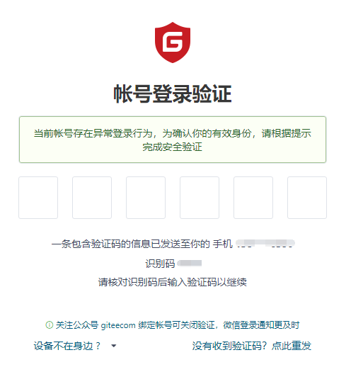

# 自动刷新 gitee pages服务

## 使用

需要在你的github actions中使用，你可以按如下配置

```yaml
- uses: okou19900722/gitee-pages@v1
  with:
    username: "你的gitee账号"
    password: ${{ secrets.你的gitee密码 }}
    repository: "需要发布的仓库地址"
    branch: "需要发布的分支"
    directory: "需要发布的目录"
    #是否开启https
    https: false
```

## 已知问题

如果action日志中出现的错误是

```
Error: 找开的页面一直不对，重试了100 次https://gitee.com/login/two-factor?verify_token=xxxxxxxxxxxxxxxxxxxxxx
```

翻墙后访问该网站可以得到如图所示，这是因为gitee自动开启了两步校验，按图中提示，关注公众号，并绑定账号，即可解决



## 开发

在本地开发时，需要在根目录下创建一个 set-env.js 文件，内容如下，也可直接复制set-env-template.js为set-env.js，再填写相关内容。

```javascript
const actionInput = {
    username: "你的gitee账号",
    password: "你的gitee密码",
    repository: "需要发布的仓库地址",
    branch: "需要发布的分支",
    directory: "需要发布的目录",
    https: false//是否开启https
}

const tmp = {}
for(let name of Object.keys(actionInput)) {
    const key = `INPUT_${name.replace(/ /g, '_').toUpperCase()}`
    tmp[key] = actionInput[name]
}

module.exports = {
    ...tmp,
}

```

其实 `actionInput` 的配置与 github pages的 workflows文件一致。

然后执行 `npm install` 安装依赖

如果安装puppeteer失败，可先全局安装cross-env，然后再执行下面代码
```
cross-env PUPPETEER_DOWNLOAD_HOST=https://npm.taobao.org/mirrors/ npm install
```

最后执行 `npm run dev` 即可在本地运行

